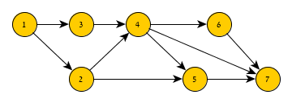
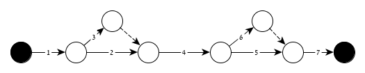
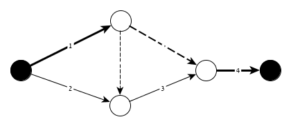
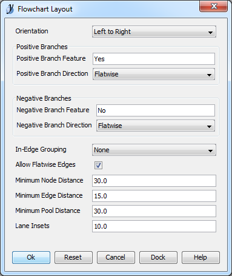

Activity Arrow Diagram Generator
======

Representing the dependency tree of activities within a project is better done with arrow diagrams compared to node diagrams (Which is how MS-Project draws them). The difference is that in a node diagram every node is an activity and an edge is a dependency. With arrow diagrams, the activity is the edge and nodes represent events (like the start/end events of the activities).

Following the guidance of IDesign's project design methods, I have come to appreciate the arrow diagram as a tool to visualize and understand the forces that operate within a project and its activity dependencies.

The problem is that for small projects (with a few dozen activities) it is a time consuming effort, while for big projects (> 80 activities) it becomes a real challenge. I came across a project I wanted to draw a diagram for, it had 76 activities, and I failed to complete the diagram regardless of how hard I tried. After a couple of hours wasted, I decided spending that time on writing a tool to generate such diagrams would be a more reasonable investment.

In this project I rely heavily on the great library [QuickGraph](https://quickgraph.codeplex.com/). For more information and a quick overview of the tools and approaches I use you can read my post about [working with graph data structures in .Net](http://blog.boxofbolts.com/dotnet/graphs/2015/08/31/working_with_graph_data_structures_dot_net/).

## Visual Example ##

Assume we have the following project:

* Activity 1
* Activity 2 - Depends on 1
* Activity 3 - Depends on 1
* Activity 4 - Depends on 2, 3
* Activity 5 - Depends on 2, 4
* Activity 6 - Depends on 4
* Activity 7 - Depends on 4, 5, 6

Using a node diagram we could represent it like this:

And with an arrow diagram it would look like this:

In small graphs like the above the different is really subtle, but the more complex the project gets the easier it is to read its arrow diagram compared with its node diagram.

> Note: The arrow diagram looks simpler also due to the fact that I *transitively reduced* it. See more below.

## What you get ##

This project contains three main parts:

- Readers - Represent ways a project can be read
- Writers - Represent ways a diagram can be written
- Generator - Generates an activity arrow diagram from a project
- A QuickGraph implementation of a *Transitive Reduction* algorithm. I Use this algorithm as a first step to reduce the complexity of the input activity network.

The project also contains a sample console application demonstrating the usage of those parts. This sample application is useful in itself since it covers what I needed from this project.

## Readers ##

The readers are tasked with providing the system with a list of activities and the dependencies between the activities. 

On top of just the activity ID and its dependencies. Arrow diagrams could also visualize the critical path and the float of the activities as well as visualizing milestones using a different node type. (Not all of these features are currently supported) To provide the generator with the data required for these visualizations, it is optional to provide the reader with the *duration* and the *total slack* of the activity.

### The CSV Reader ###

The CSV reader takes it's input from a simple CSV file. The CSV file **must** have a header line and the following columns are mandatory (Case Sensitive):

- ID - The integer identifier of this activity
- Predecessors - A comma delimited list of IDs this activity **depends on** i.e.

The following columns are optional:

- Duration - The duration of the activity as an integer number. Since exporting from MS Project is common, this value could be suffixed with "Days" unit and it will be ignored. (This is how Project exports those values to the clipboard)
- Total Slack - The total slack of the activity as an integer number (also could be suffixed with "Days"). This value is also used to determine criticality, 0 Total slack is considered Critical.

The above example could be found as a csv sample input file [here](./docs/assets/sampleInput.csv)

### The MS Project file Reader ###

Since working with MS Project to calculate different aspects of the project is common. I have implemented a reader for this file type. I rely on the [MPXJ](http://mpxj.sourceforge.net/) project libraries to do that. It's a quirky solution with binding for .Net of a Java implementation. Also the [Nuget](https://www.nuget.org/packages/net.sf.mpxj/) package pulls in dozens of DLLs. Still, it gets the job done if you care to use it.

Currently it pulls from the project file the same columns the CSV reader supports.

## Writers ##

The writers are tasked with producing the arrow diagram from the graph generated by the generator. The diagrams are visual representations and so I have followed the styling approach IDesign's architects use to create those visualization to make it familiar.

In those representations the following notation is used:

- Standard Line - Is an activity edge
- Dashed Line - Is a dummy line representing dependency where there is not activity (this is an artifact of building those diagrams where we cannot 'split' and edge, but we need to)
- Bold Line (Either standard or dashed) - Represents criticality, meaning the edge is on the critical path of the project.
- Empty Node - An event within the network (end event or start event)
- Full Node - A start/end event of the entire graph. If you have any other number but two of those, you probably have a problem with your project planning (dangling activities, cycles etc.)

### The yEd Graph Editor GraphML Writer ###

I love [yEd](http://www.yworks.com/en/products/yfiles/yed/). It's powerful, free, and talks the language of graphs. I built a writer to "speak" the yEd variant of GraphML and produce the styling of the individual elements of the graph. Still, you would have to use yEd to perform the layout process of the graph which would probably require also some manual labor.

After you open the result *graphml* file in yEd you would see only this:

This is the entire graph super-imposed into one coordinate - Since I did not set the coordinates of any of the elements. I suggest you experiment with the `Layout` menu to auto-layout this graph and start working on it. I find the following gets me to a reasonable starting point - Open the menu `Layout` -> `FlowChart`. Set it up like this:

I can't get you all the way to a great arrow diagram, you would have to do some labor on it I am afraid.

### The GraphViz Writer ###

This writer produces DOT files, which is the scripting language of the [GraphViz](http://www.graphviz.org/) tool-set. These DOT files are not the final product, you would have to run them through the GraphViz tools to get the final diagram.

If you have GraphViz installed, open from the `bin` library the `gvedit.exe` tool which is the simplest way to load and "execute" dot files. If you want to do some more advanced stuff you will have to dive deeper into GraphViz.

Alternatively, to get a quick SVG output of the DOT file, you can paste its content on the browser based port of GraphViz you can find [here](http://www.webgraphviz.com/).

The downside of using GraphViz compared with yEd Graph Editor is that the final image is static and you cannot improve it manually. Usually though, the static output is quite good as it is.

## The Generator ##

The generator follows a basic algorithm I came up with to generate the final arrow graph. I will explain more about the steps of this algorithm in a blog post I plan to publish soon.

The generator can be used standalone as long as you can provide it with the expected data (activities and dependencies) and work with the output result (graph). I have some vague plans to embed it in an office store app targeting MS Project, but I guess free time stands between me and this goal.

The generator still produces quite verbose diagrams and does not support some fancy optimizations like collapsing multiple activities into one edge (when possible) and reducing diagram complexity by introducing milestones. I would appreciate any contributions to improve on that.

# Contributing #

There is a lot more to do to make this a useful tool (for the admittedly small community of people who actually needs it). I would love PR's, Comments or Issues opened. Any feedback on the work I have done is welcome and appreciated.

# Requirements #

- .Net 4.5

# Credits #

Thanks [IDesign](http://www.idesign.net/), for exposing me to arrow diagrams.